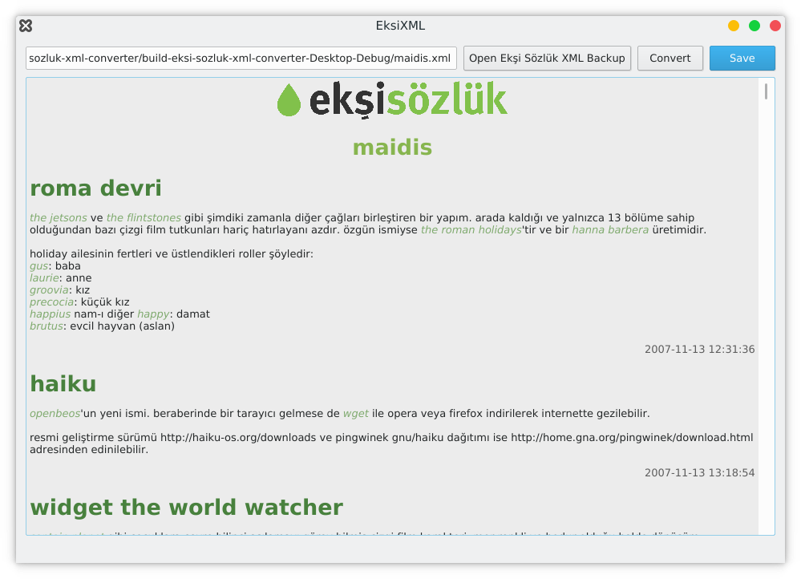
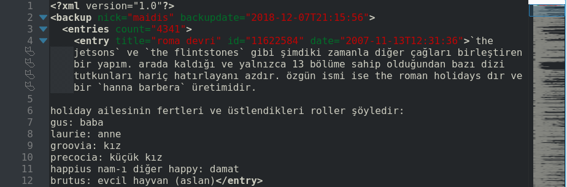
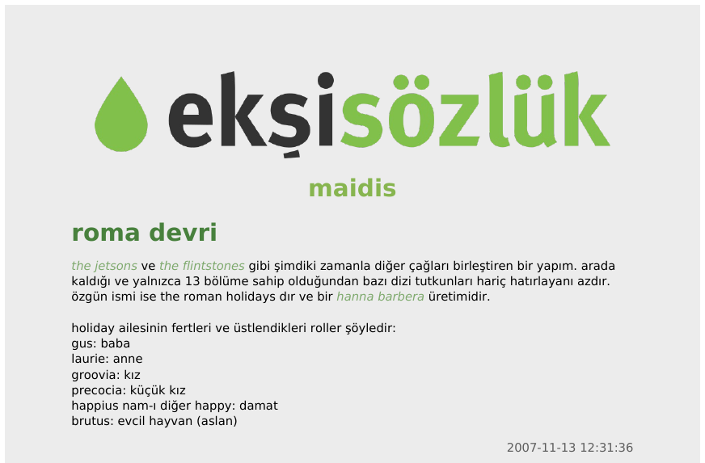

# eksi-sozluk-xml-converter
Ekşi Sözlük XML Yedek Dosyası için Dönüştürücü

eksi-sozluk-xml-converter, Ekşi Sözlük'ün XML biçimli yedek dosyasını Ekşi Sözlük'ün görünüşüne benzer bir PDF dosyasına çevirir. Temel kullanımlar için kolayca kullanılabilir.

Aslında eksixml2pdf isimli bir terminal uygulaması yazacaktım ama [PoDoFo](http://podofo.sourceforge.net/)'yu kullanmak düşündüğümden daha zor olduğu için bundan vazgeçtim. Qt'a geçince grafik arayüz temelli bir dönüştürücü yapmaya karar verdim.

Ekşi Sözlük'teki yazılarını silip giden yazarlar, yazdıklarını daha okunabilir bir biçimde paylaşmak isterse kullanabilir. Veya benim gibi yazdıklarını toplu halde görüp düzeltme/temizlik gereken yazılarını tespit etmek isteyenler faydalanabilir.

## Kullanılışı

Ekşi Sözlük'e yıllarınızı verip faydalı veya eğlenceli içerikler oluşturun.

Çeşitli nedenlerle kullanmak için Ekşi Sözlük'ten ayarlar > yedek yolunu takip ederek yedek dosyanızı indirin.

eksi-sozluk-xml-converter'ı kullanarak göze hoş gelen bir PDF dosyası üretin.

## Kullananlar

eksi-sozluk-xml-converter'ı bildiğim kadarıyla çeşitli devlet kurumları ve özel şirketler kullanmaktadır. Bunlardan bazıları:

- [maidis](https://www.dropbox.com/s/0450xp3gb2wem2u/maidis-eksisozluk.pdf?dl=0)

Siz de eksi-sozluk-xml-converter'ı kullanıyorsanız listeye isminizi ekletebilirsiniz.

## Yapılacaklar

- ~~Basit bir grafik arayüz yap~~
- Ekşi Sözlük logosunu gerekirse çalıştırılabilir dosyadan doğrudan ya da çıkartarak kullan.
- Arayüzde oluşturulacak dosya için özelleştirmeler ekle
- ~~Düz metin çıktısı~~
- ~~HTML çıktısı~~
- Dış bağlantıları tıklanabilir yap
- Doğrudan resim dosyalarına verilmiş bağlantıları resim olarak çıktıya ekleme seçeneği
- YouTube'a verilmiş bağlantıları videonun önizleme resmi olarak çıktıya ekleme seçeneği
- Verilmiş bkz'lar çıktıda başlık olarak bulunuyorsa buralara gitmesi için iç bağlantılar oluştur
- Çıktıyı tarihsel olarak vermenin yanı sıra alfabetik olarak da oluşturma seçeneği
- Akıllı bkz'lar için biçimlendirme ekle (yerinde üst karakter olarak, sayfa sonuna veya belge sonuna dipnot olarak)
- spoiler'lar için biçimlendirme (alıntı şeklinde)
- ~~bkz'lar için biçimlendirme~~

# Bilinen Hatalar
- bkz'da kesme ve amp

## Alternatifler

eksi-sozluk-xml-converter, bu iş için yazılmış tek araç değil. Ayrıca şu araçlara da göz atabilirsiniz:

- [EksiXMLtoPDF](https://github.com/Borgen/EksiXMLtoPDF)
- [Detox](https://youreads.net/baslik/detox--45069)
- [ekşi yedek okuma şeysi](https://eksisozluk.com/eksi-yedek-okuma-seysi--4987996)
- [ekşi yedek](https://eksiyedek.subicon.net/)

## Uyarı

Ekşi Sözlük ismi ve logosu Ekşi Teknoloji ve Bilişim A.Ş.'ye aittir. Burada izinsiz kullanılmıştır. eksi-sozluk-xml-converter'ın Ekşi Sözlük ve Ekşi Teknoloji ve Bilişim A.Ş. ile bir ilgisi yoktur.
